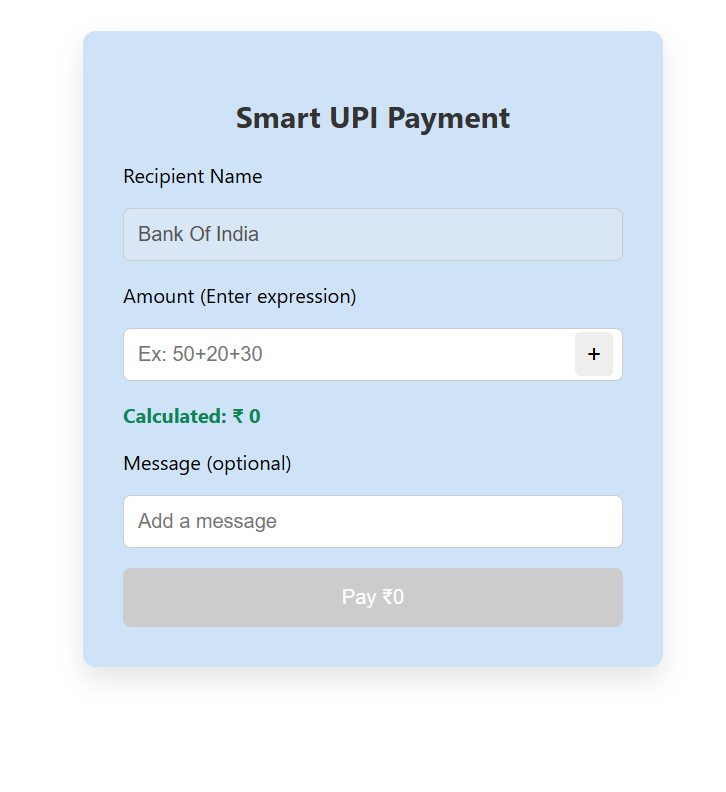
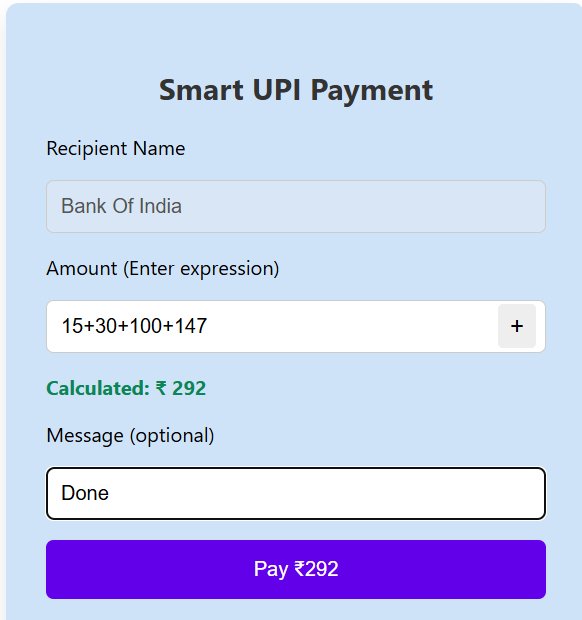

# Smart UPI Payment Splitter 💸

A smart and user-friendly UPI payment input built with ReactJS that lets users directly type expressions like `100+50+20` instead of calculating totals manually. Designed especially for mobile UPI users who struggle with keyboards missing the `+` sign.

---

## ✨ Features

- 🔢 Input arithmetic expressions (e.g. `120+80+100`)
- ➕ Dedicated `+` button for mobile keyboards
- ✅ Auto total calculation
- ❌ Disables payment if amount is 0 or invalid
- 🎉 Animated success confirmation on payment
- 🧼 Auto-reset after successful payment
- 📱 Fully mobile-friendly

---

## 🚀 Live Demo

👉 [Click here to view the live app](https://smart-upi-splitter.netlify.app)  
*(Replace with your real Netlify URL)*

---

## 📸 Preview

 
   


---

## 🛠 Tech Stack

- ReactJS
- JavaScript
- HTML/CSS
- Netlify (for deployment)

---

## 🧠 Use Case

Useful for:
- UPI-based fintech apps (PhonePe, GPay, Paytm clones)
- Expense splitters
- Smart payment interfaces

---

## 📦 Setup Instructions

```bash
git clone https://github.com/sameer0288/smart-upi-payment-splitter.git
cd smart-upi-payment-splitter
npm install
npm start
